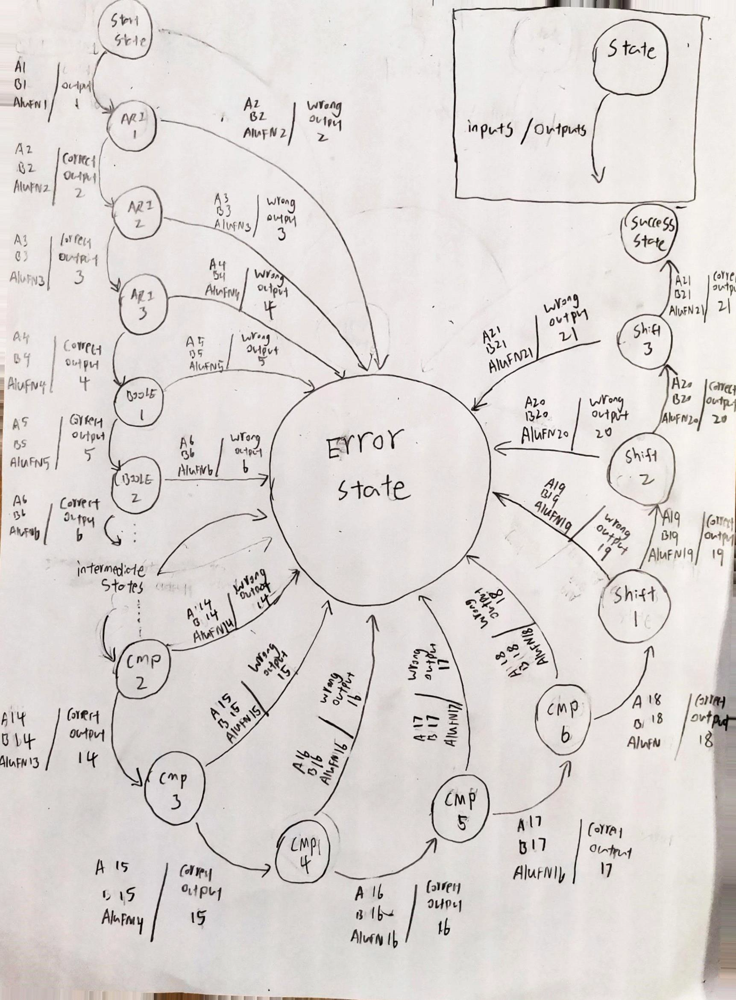

# 1D_16BitALU  
50.002 Group 3-7

## ALU Functions implemented  
| Operation 	| ALUFN [5:0] 	| Description 	|
|-----------	|-------------	|---------------------------	|
| ADD 	| 0 	| A + B 	|
| SUB 	| 1 	| A - B 	|
| MUL 	| 10 	| A * B 	|
| AND 	| 11000 	| Bitwise AND of A, B 	|
| OR 	| 11110 	| Bitwise OR of A, B 	|
| XOR 	| 10110 	| Bitwise XOR of A, B 	|
| ‘A’ 	| 11010 	| A 	|
| NAND 	| 10111 	| Bitwise NAND of A, B 	|
| NOR 	| 10001 	| Bitwise NOR of A, B 	|
| XNOR 	| 11001 	| Bitwise XNOR of A, B 	|
| ‘B’ 	| 11100 	| B 	|
| SHL 	| 100000 	| Shift A left by B 	|
| SHR 	| 100001 	| Shift A right by B 	|
| SRA 	| 100011 	| Shift A right by B signed 	|
| CMPEQ 	| 110011 	| A == B 	|
| CMPLT 	| 110101 	| A < B 	|
| CMPLE 	| 110111 	| A <= B 	|

## FSM Description of our tester  
  

| Index 	| State 	| Operation 	| ALUFN [5:0] 	| Input A (Binary) 	| Input B (Binary) 	| Correct Output (Binary) 	| Next State (If Correct Output) 	| Next State (If Any Wrong Output) 	|
|-------------------------------------------------------------------------------------------------------------------------------------------------------------------------------------	|---------	|------------------------	|-------------	|------------------	|------------------	|-------------------------	|--------------------------------	|----------------------------------	|
| 1 	| START 	| N/A 	| N/A 	| N/A 	| N/A 	| N/A 	| ARI 1 	| N/A 	|
| 2 	| ARI 1 	| A + B 	| 000000 	| 0000001101101100 	| 0000010001110001 	| 0000011111011101 	| ARI 2 	| ERROR 	|
| 3 	| ARI 2 	| A - B 	| 000001 	| 0010101101100111 	| 0000000101111100 	| 0010100111101011 	| ARI 3 	| ERROR 	|
| 4 	| ARI 3 	| A * B 	| 000010 	| 0000011111100011 	| 0000000110010111 	| 1000100111100101 	| BOOLE 1 	| ERROR 	|
| 5 	| BOOLE 1 	| A and B 	| 011000 	| 0001000111010111 	| 0001101010000101 	| 0001000010000101 	| BOOLE 2 	| ERROR 	|
| 6 	| BOOLE 2 	| A xor B 	| 010110 	| 0000000101110000 	| 0001000010001010 	| 0001000111111010 	| BOOLE 3 	| ERROR 	|
| 7 	| BOOLE 3 	| A or B 	| 011110 	| 0000001000011111 	| 0000000001011001 	| 0000001001011111 	| BOOLE 4 	| ERROR 	|
| 8 	| BOOLE 4 	| A 	| 011010 	| 0000110111010110 	| 0000000100101000 	| 0000110111010110 	| BOOLE 5 	| ERROR 	|
| 9 	| BOOLE 5 	| A nand B 	| 010111 	| 0000001010000110 	| 0000001101101100 	| 1111110111111011 	| BOOLE 6 	| ERROR 	|
| 10 	| BOOLE 6 	| A xnor B 	| 011001 	| 0100101110101111 	| 0100000010100000 	| 1111010011110000 	| BOOLE 7 	| ERROR 	|
| 11 	| BOOLE 7 	| A nor B 	| 010001 	| 0000101000010011 	| 0000000100010011 	| 1111010011101100 	| BOOLE 8 	| ERROR 	|
| 12 	| BOOLE 8 	| B 	| 011100 	| 0000000000101101 	| 0000000001010100 	| 0000000001010100 	| CMP 1 	| ERROR 	|
| 13 	| CMP 1 	| A = B 	| 110011 	| 0101010101010101 	| 0101010101010101 	| 0000000000000001 	| CMP 2 	| ERROR 	|
| 14 	| CMP 2 	| A = B 	| 110011 	| 0101010101010101 	| 0000000000000000 	| 0000000000000000 	| CMP 3 	| ERROR 	|
| 15 	| CMP 3 	| A > B 	| 110101 	| 0000000000010101 	| 0000001000000000 	| 0000000000000001 	| CMP 4 	| ERROR 	|
| 16 	| CMP 4 	| A > B 	| 110101 	| 0000001000000000 	| 0000000000010101 	| 0000000000000000 	| CMP 5 	| ERROR 	|
| 17 	| CMP 5 	| A >= B 	| 110111 	| 0000000000010101 	| 0000001000000000 	| 0000000000000001 	| CMP 6 	| ERROR 	|
| 18 	| CMP 6 	| A >= B 	| 110111 	| 1000000000000000 	| 0000000000010101 	| 0000000000000000 	| SHIFT 1 	| ERROR 	|
| 19 	| SHIFT 1 	| Shift Left 	| 100000 	| 0000111000110000 	| 0011010101011010 	| 1100000000000000 	| SHIFT 2 	| ERROR 	|
| 20 	| SHIFT 2 	| Shift Right 	| 100001 	| 0000111000110000 	| 0011010101011010 	| 0000000000000011 	| SHIFT 3 	| ERROR 	|
| 21 	| SHIFT 3 	| Shift Right Arithmetic 	| 100011 	| 1000011100011000 	| 0011010101011010 	| 1111111111111111 	| SUCCESS 	| ERROR 	|
| 22 	| ERROR 	| N/A 	| N/A 	| N/A 	| N/A 	| N/A 	| N/A 	| ERROR 	|
| 23 	| SUCCESS 	| N/A 	| N/A 	| N/A 	| N/A 	| N/A 	| N/A 	| ERROR 	|   

START state is the first state. If any inputs are given, it goes to the next state, which is ARI 1.   
Whenever the state produces a wrong output, it goes to ERROR state. ERROR state does not accept any inputs, or produce any output. The finite state machine terminates.  
If SHIFT 3 state produces a correct output, it goes to SUCCESS state. If the finite state machine arrives at SUCCESS state, it means that all the operations in ALU works properly.  
